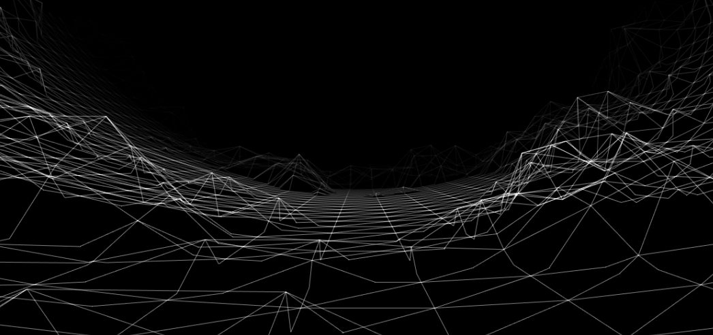
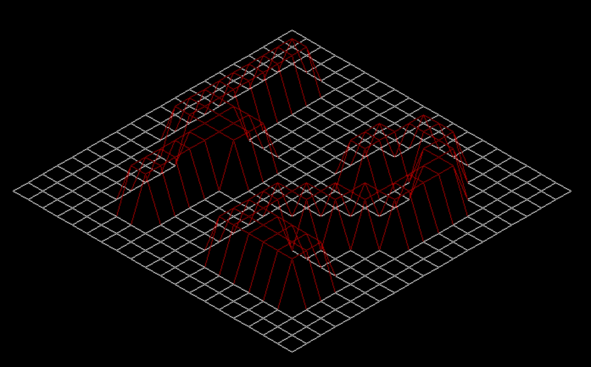
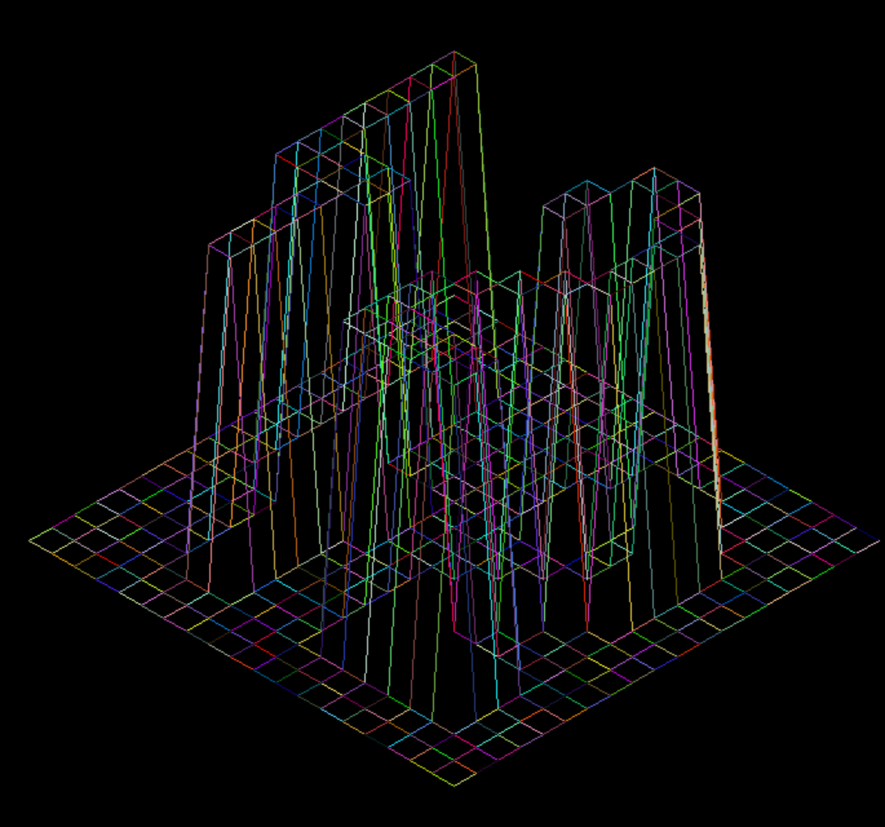
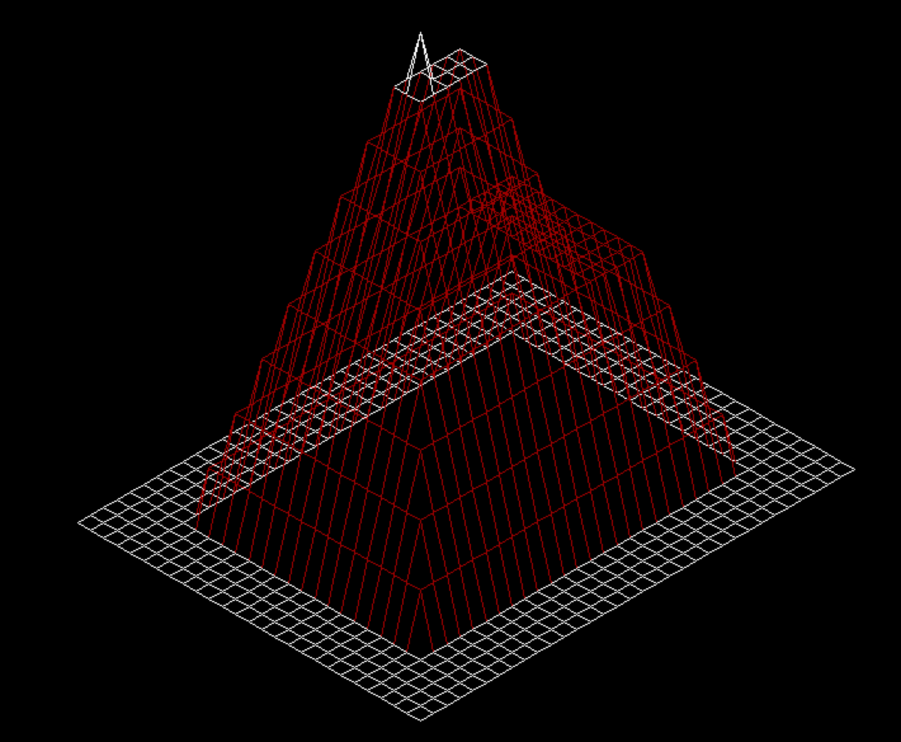
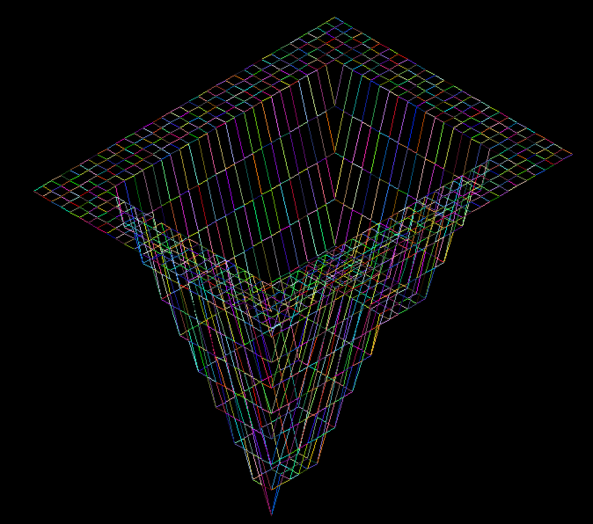
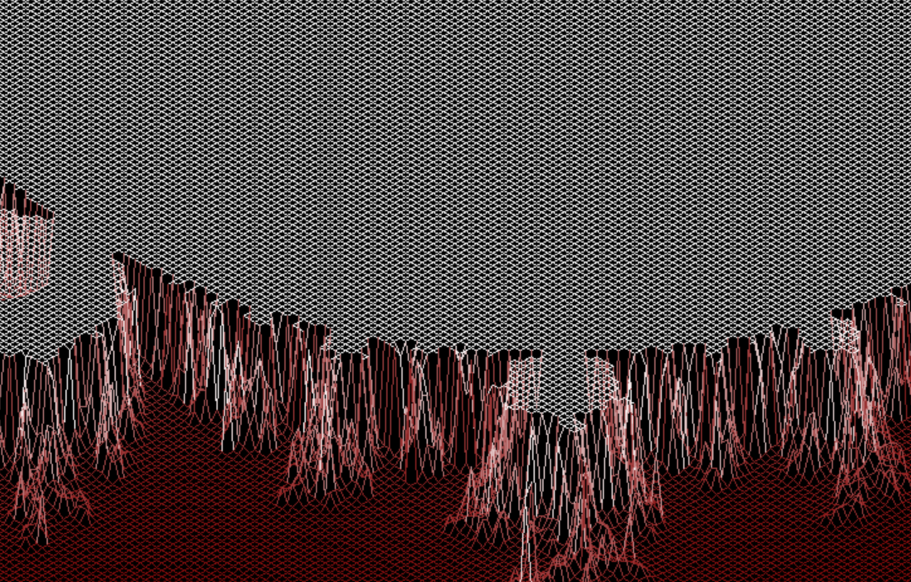
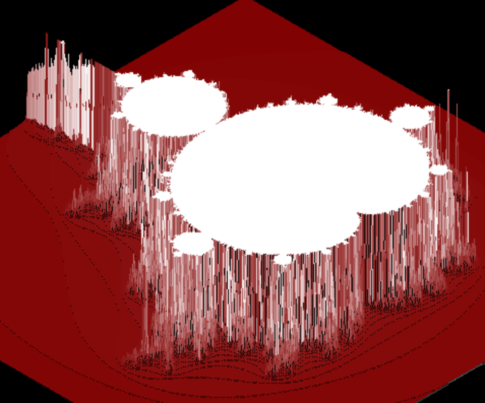
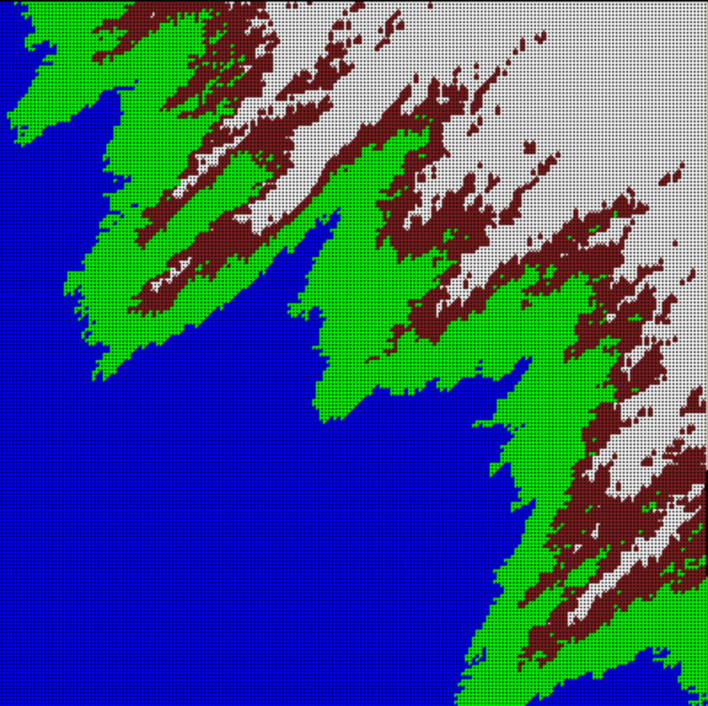
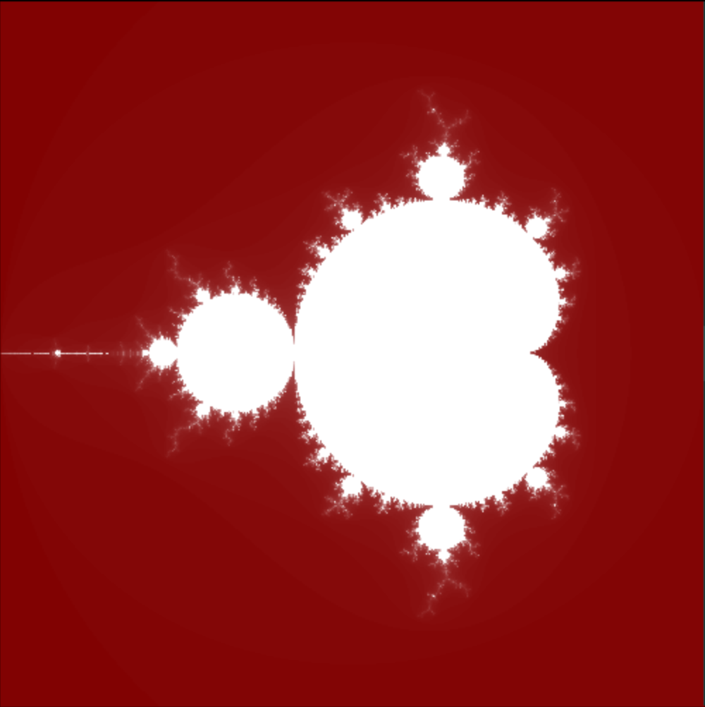
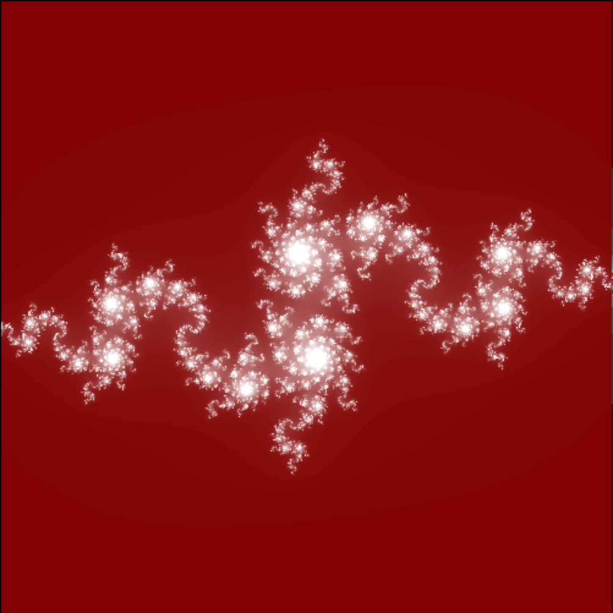

# FDF_42
---
## Project Overview
---

**FDF** is a **42 Project** to learn about 3d programming. The program takes a map as parameter and creates its 3d representation.

In this project, you will discover the basics of graphic programming, and in particular
how to place points in space, how to join them with segments, and most importantly how
to observe the scene from a particular viewpoint.

The representation in 3D of a landscape is a critical aspect of modern mapping. For
example, in these times of spatial exploration, to have a 3D representation of Mars is a
prerequisite condition to its conquest. As another example, comparing various 3D representations of an area of high tectonic activity will allow you to better understand these
phenomena and their evolution, and as a result, be better prepared.

It’s your turn today to modelize in 3D some magnificent landscapes, imaginary or not...



## Sources
---
In our school we will need to do everything from scratch. In this case it meant that we weren't given any line drawing function so we had to figure ourselves how to color pixels beetween line end points with help of [miniLibX](https://aurelienbrabant.fr/blog/getting-started-with-the-minilibx) library. 

I used [Bresenham's line algorithm](https://en.wikipedia.org/wiki/Bresenham%27s_line_algorithm) for drawing a line which was the most obvious choice.

* others sources should help you
	* [Isometric Projection](http://www.gandraxa.com/isometric_projection.xml)
	* [Hooks and Events](https://harm-smits.github.io/42docs/libs/minilibx/events.html)
	* [MLX Images](https://github.com/keuhdall/images_example)
	* [FDF Cookbook](https://disk.yandex.ru/d/Y618wPWjYkOqXg)

## Compiling and running
---

Run <mark>make</mark>. An executable will compile. Currently only tested on OS X.

Run it with <mark>./fdf [map]</mark>. A bunch of sample maps are provided in the <mark>maps directory.</mark> 

* **for mandatory part** :

```bash
$ make
$ ./fdf [map]
```
OR :

```bash
$ make
$ ./fdf [map] [map zoom(int)] [map altitude(int)]
```

* **for bonus part** :

```bash
$ make bonus
$ ./fdf [map]
```
OR :

```bash
$ make bonus
$ ./fdf [map] [map zoom(int)] [map altitude(int)]
```
	


## Usage
---
After running <mark>make</mark> to generate the fdf executable you can run the program with <mark>./fdf [valid_fdf_file]</mark>.

A valid fdf file will consist of a matrix of number delimited by spaces. Each number's position represents an (x , y) coordinate with the value of the number itself representing a height (z).

Valid fdf files will always have the same number of elements per row.

Example:

```0  0  0  0  0  0  0  0  0  0  0  0  0  0  0  0  0  0  0  0
0  0  0  0  0  0  0  0  0  0  0  0  0  0  0  0  0  0  0  0
0  0  0  0  0  0  0  0  0  0  0  0  0  0  0  0  0  0  0  0
0  0  0 50 50  0  0  0  0  0  0  0 50 50 50  0  0  0  0  0
0  0  0 50 50  0  0  0  0  0  0  0 50 50 50 50  0  0  0  0
0  0  0 50 50  0  0  0  0  0  0 50 50  0 50 50 50  0  0  0
0  0  0 50 50  0  0  0  0  0  0 50 50  0  0 50 50  0  0  0
0  0  0 50 50  0  0  0  0  0  0 50 50  0  0 50 50  0  0  0
0  0  0 50 50  0  0  0  0  0  0  0  0  0  0 50 50  0  0  0
0  0  0 50 50 50 50 50  0  0  0  0  0  0 50 50 50  0  0  0
0  0  0 50 50 50 50 50  0  0  0  0  0 50 50 50  0  0  0  0
0  0  0 50 50 50 50 50  0  0  0  0 50 50 50  0  0  0  0  0
0  0  0  0  0 50 50  0  0  0  0 50 50 50  0  0  0  0  0  0
0  0  0  0  0 50 50  0  0  0  0 50 50  0  0  0  0  0  0  0
0  0  0  0  0 50 50  0  0  0  0 50 50 50 50 50 50  0  0  0
0  0  0  0  0 50 50  0  0  0  0 50 50 50 50 50 50  0  0  0
0  0  0  0  0 50 50  0  0  0  0 50 50 50 50 50 50  0  0  0
0  0  0  0  0  0  0  0  0  0  0  0  0  0  0  0  0  0  0  0
0  0  0  0  0  0  0  0  0  0  0  0  0  0  0  0  0  0  0  0
0  0  0  0  0  0  0  0  0  0  0  0  0  0  0  0  0  0  0  0
```

## Output
---

The program will attempt to render the model described by the fdf file in a graphical window.



The user can interact with the graphical model with the following commands:

```
MVM : up/down/right/left
ZOOM : 
	- zoom_up : O
	- zoom_down : I
3D/PARALLEL : p
ROTATION :
	- axe_x : X
	- axe_y : Y
	- axe_z : Z
ALTITUDE :
	- up : +
	- down : -
EXIT : ESC
RANDOM COLOR :
	- original/random : R
```









